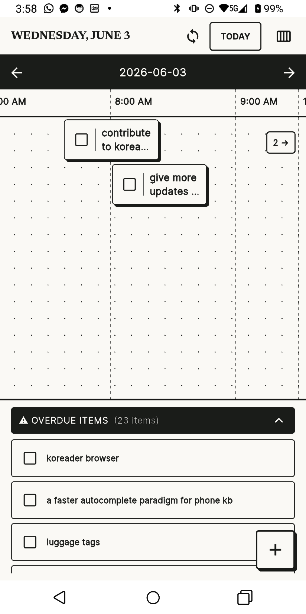
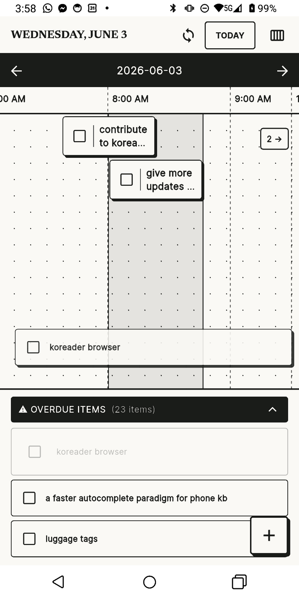
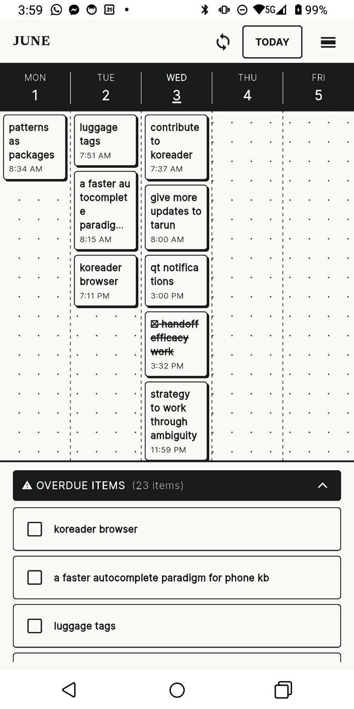
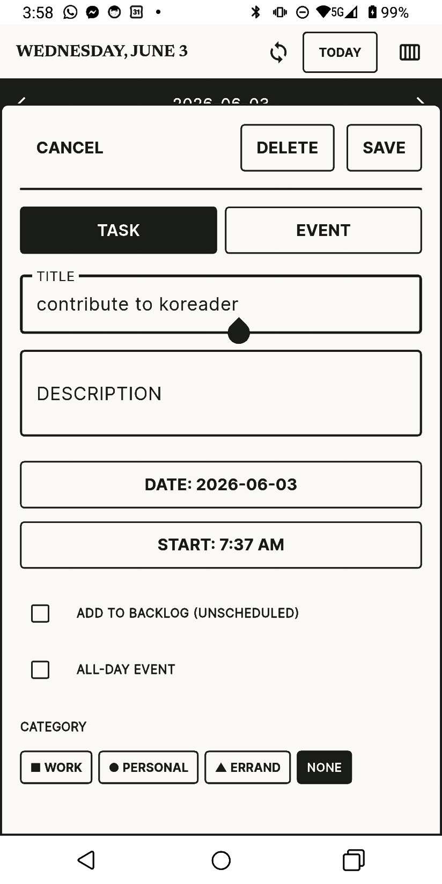

# QuickTasks

Google Calendar is a fine backend — it stores events reliably, syncs everywhere, and has a solid API. But its UI isn't great for actually getting things done. Adding a quick task takes too many taps. Overdue items scroll into the past and disappear. There's no single view that answers "what do I need to do today?"

QuickTasks is a Flutter app that uses Google Calendar as its only backend but replaces the frontend entirely. Everything — tasks, events, stuff from other calendars — shows up on one timeline. Tasks are just calendar events with some metadata tucked into `extendedProperties`, so they survive app reinstalls and don't depend on a separate server. The goal is one app to check instead of two.

It's built for an e-ink Android phone as the primary device, so the design is high-contrast, no animations, no color — just borders, shapes, and text.

## Screenshots

<p align="center">
  
  
  
  
</p>

## Features

- **Two-way Google Calendar sync** — reads events from all your calendars and writes tasks/events to a dedicated "QuickTasks" calendar. Uses incremental sync tokens so it doesn't refetch everything each time.
- **Day view** — a 30-minute slot timeline for the current day. Tap an empty slot to create a task at that time. Hold and drag down across slots to create an event spanning that duration.
- **Week view** — a 5-column layout showing today ±2 days. Swipe to shift by 2 days, with a Today button to recenter.
- **Tasks and events** — both are stored as Google Calendar events. Tasks default to 30 minutes and can be marked complete. Events use whatever duration you give them.
- **Swipe gestures** — swipe left on a task to complete it, swipe right to quick-reschedule (+30m, +1h, +3h, tomorrow, or pick a time).
- **Overdue tray** — tasks past their scheduled time collect at the bottom of the day/week views. You can tap to reschedule or drag them back onto the timeline.
- **Backlog** — unscheduled tasks live in a drawer you can pull out. These are tasks without a specific time.
- **Home screen widget** — an Android widget showing upcoming tasks.
- **Offline-first** — local SQLite database (via Drift) caches everything. Edits are queued locally and synced when you're back online.
- **Categories** — tasks can be tagged as work, personal, or errand. Shown with shapes (■ ● ▲) instead of colors.

## Design

The UI uses a "Tactile E-Paper" theme designed for e-ink screens — high contrast, no animations, no gradients, solid borders. Text is set in Newsreader (for titles/headers) and Inter (for body and labels). Minimum tap targets are 56px.

## Tech stack

- Flutter / Dart
- Riverpod (state management)
- Drift (SQLite)
- go_router (navigation)
- Google Calendar API via `googleapis` + `google_sign_in`
- `home_widget` for the Android widget

## Project structure

```
lib/
├── app/            # Router, theme
├── data/
│   ├── local/      # Drift database, DAOs
│   └── remote/     # Google Calendar API client
├── domain/
│   └── models/     # CalendarItem, enums
├── features/
│   ├── calendar/
│   │   ├── day_view/
│   │   └── week_view/
│   ├── items/      # Item chips, create/edit bottom sheet
│   ├── backlog/    # Backlog drawer and tray
│   └── sync/       # Google auth, calendar sync, widget sync
└── main.dart
```

## Setup

1. Clone the repo
2. Run `flutter pub get`
3. You'll need a Google Cloud project with the Calendar API enabled and an OAuth client ID configured for Android
4. Build and run with `flutter run`

## Status

MVP is feature-complete. Google Calendar sync, day/week views, task management, and the home screen widget are all working. Not yet built: NLP quick capture, dark theme, notifications, recurring tasks, macOS support.
